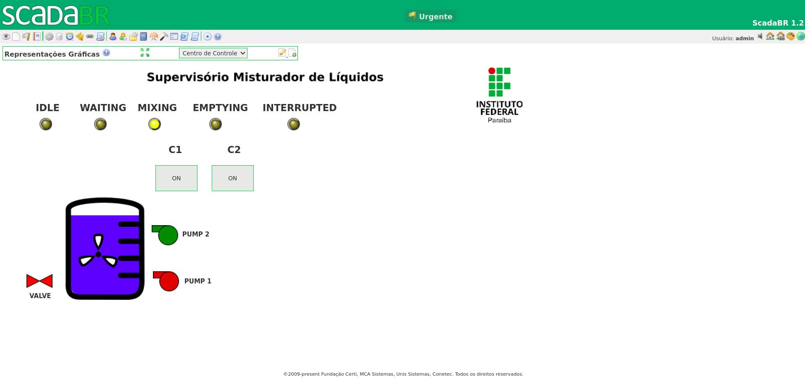

# Projeto: Misturador de Líquidos com Supervisŕio utlizando ESP32 e ScadaBR

## Descrição Geral
Este projeto implementa um sistema de mistura de líquidos controlado por um **ESP32** e visualizado em um supervisório **ScadaBR** utilizando o protocolo **Modbus IP**. O sistema gerencia as bombas, o misturador e os sensores de nível, e permite a interação remota via Modbus.

## Funcionamento do Sistema

### Sistemas Supervisórios

Um sistema supervisório é uma plataforma de software projetada para monitorar e controlar processos industriais em tempo real. Esses sistemas são fundamentais na automação industrial, pois permitem que operadores visualizem e interajam com os componentes do processo, como sensores, atuadores e máquinas, através de uma interface gráfica. O principal objetivo de um sistema supervisório é garantir a eficiência, segurança e otimização dos processos produtivos, coletando dados de processo, alarmes e eventos, permitindo a tomada de decisão baseada em informações precisas e atualizadas.

#### Características dos Sistemas Supervisórios:

- **Monitoramento em Tempo Real:** Visualização do estado atual do processo através de gráficos, tabelas e representações esquemáticas.
- **Controle de Processos:** Possibilidade de intervir no processo, ajustando parâmetros e controlando a operação de equipamentos remotamente.
- **Alarmes e Eventos:** Alertas automáticos sobre condições anormais, ajudando na rápida resposta a potenciais problemas ou falhas.
- **Histórico de Dados:** Armazenamento de dados históricos para análise de tendências, desempenho operacional e investigação de incidentes.
- **Interoperabilidade:** Integração com diversos dispositivos e plataformas através de padrões de comunicação industrial.

### ScadaBR

ScadaBR é um software de supervisão e aquisição de dados (SCADA) de código aberto que oferece uma plataforma versátil para desenvolvimento de aplicações de automação. É amplamente utilizado em sistemas de monitoramento e controle industrial devido à sua capacidade de se integrar com uma vasta gama de dispositivos através de protocolos industriais como Modbus, SNMP, BACnet, entre outros.

#### Características do ScadaBR:

- **Interface Configurável:** Permite que os usuários criem interfaces gráficas customizadas, adaptadas às necessidades específicas de cada processo.
- **Compatibilidade:** Suporta diversos protocolos de comunicação, facilitando a integração com hardware e software existentes.
- **Relatórios e Alarmes:** Funcionalidades avançadas para geração de relatórios e configuração de alarmes, essenciais para a gestão operacional e manutenção.
- **Código Aberto:** Sendo um projeto de código aberto, o ScadaBR pode ser modificado e melhorado pela comunidade, oferecendo flexibilidade e inovação contínua.

O ScadaBR é ideal para pequenas e médias instalações que necessitam de uma solução eficaz e econômica para automação e controle de processos. Seu ambiente de desenvolvimento amigável e a comunidade ativa contribuem para sua popularidade e evolução constante.

### Conexão Wi-Fi
O ESP32 se conecta a uma rede Wi-Fi com as credenciais fornecidas, garantindo a comunicação via Modbus IP com o supervisório. 

### Estados do Ciclo
O ciclo de mistura é composto por vários estados que são monitorados e controlados via Modbus:

- **IDLE**: Estado inativo, o sistema está pronto para iniciar um ciclo.
- **WAITING_CONFIRMATION**: Estado de espera pela confirmação do ciclo (após pressionar o botão `C1`).
- **MIXING**: Executa o ciclo de mistura, acionando bombas e o misturador.
- **EMPTYING**: Esvazia o recipiente após o ciclo de mistura.
- **INTERRUPTED**: Interrompe o ciclo de mistura quando o botão `C2` é pressionado.

### Visualização no Supervisório (ScadaBR)
Os estados do sistema e as ações são visualizados no **ScadaBR** via Modbus IP. O estado de cada componente (bombas, válvula, misturador e sensores) é enviado como **status inputs** (`Ists`) e os botões de controle (C1 e C2) são gerenciados via **coils** (saídas digitais).

## Componentes Utilizados

- **ESP32**: Controlador principal com comunicação via Modbus IP.
- **Bombas**: Acionadas para transferir líquidos durante o ciclo de mistura.
- **Misturador**: Atua por 5 segundos para misturar o líquido após as bombas serem acionadas.
- **Válvula Solenoide**: Utilizada para esvaziar o recipiente.
- **Sensores de Nível**: Detectam quando o recipiente está cheio ou vazio.
- **Botões C1 e C2**: Controlam o início do ciclo e a interrupção ou esvaziamento.

A figura 1 mostra a pinagem da ESP32.

Figura 1: Pinout da ESP32.

  

Fonte: circuits4you.com

## Pinos Utilizados

| Componente              | Pino no ESP32 |
|-------------------------|---------------|
| **Bomba 1**             | D2 (GPIO 4)   |
| **Bomba 2**             | D4 (GPIO 2)   |
| **Misturador**          | D7 (GPIO 13)  |
| **Válvula Solenoide**   | D8 (GPIO 15)  |
| **Sensor de Nível Baixo** | D5 (GPIO 14) |
| **Sensor de Nível Cheio** | D6 (GPIO 12) |

## Ciclo de Mistura

O ciclo de mistura funciona em etapas:

1. **Acionamento da Bomba 1**: Funciona por 5 segundos.
2. **Acionamento da Bomba 2**: Funciona até que o sensor de nível cheio seja acionado.
3. **Misturador**: Liga por 5 segundos.
4. **Válvula Solenoide**: Abre até que o sensor de nível vazio seja acionado, esvaziando o recipiente.

### Interrupção e Esvaziamento
- **Botão C2**: Quando pressionado durante a execução de um ciclo, o sistema interrompe imediatamente as operações. Se pressionado no estado IDLE, o sistema esvazia o recipiente.

## Comunicação via Modbus IP

### Registradores Modbus

| Registrador | Função                         |
|-------------|---------------------------------|
| **C1_COIL** | Aciona o botão virtual `C1`       |
| **C2_COIL** | Aciona o botão virtual `C2`       |
| **PUMP1_ISTS** | Status da Bomba 1            |
| **PUMP2_ISTS** | Status da Bomba 2            |
| **MIXER_ISTS** | Status do Misturador         |
| **VALVE_ISTS** | Status da Válvula Solenoide  |
| **LOW_LEVEL_ISTS** | Status do Sensor de Nível Baixo |
| **HIGH_LEVEL_ISTS** | Status do Sensor de Nível Cheio |
| **IDLE_ISTS** | Status de Inatividade (IDLE)  |
| **WAITING_ISTS** | Status de Espera (WAITING_CONFIRMATION) |
| **MIXING_ISTS** | Status de Mistura (MIXING)  |
| **EMPTYING_ISTS** | Status de Esvaziamento (EMPTYING) |
| **INTERRUPTED_ISTS** | Status de Interrupção (INTERRUPTED) |

## Implementação

O código utiliza a biblioteca **ModbusIP_ESP8266** para a comunicação Modbus, gerenciando a interação com os coils e inputs digitais. O ciclo de mistura é controlado de forma automática, e os estados são atualizados continuamente no supervisório via Modbus, o código pode ser visualozado [aqui](/Mixer-ScadaBR/main/Mixer-ScadaBR/Mixer-ScadaBR.ino).

### 1. Tabela de Máquina de Estados

| **Estado Atual** | **Evento/Entrada**  | **Próximo Estado** | **Ação/Descrição**                                  |
|------------------|---------------------|--------------------|----------------------------------------------------|
| **IDLE**         | `C1` Pressionado       | WAITING            | Aguardar a confirmação de início do ciclo.         |
| **IDLE**         | `C2` Pressionado       | EMPTYING           | Iniciar esvaziamento do recipiente.                |
| **WAITING**      | `C1` Pressionado       | MIXING             | Iniciar o ciclo de mistura.                        |
| **MIXING**       | `C2` Pressionado       | INTERRUPTED        | Interromper o ciclo de mistura e desligar os equipamentos. |
| **MIXING**       | Fim do ciclo         | EMPTYING           | Finalizar o ciclo de mistura e iniciar esvaziamento.|
| **EMPTYING**     | `C2` Pressionado       | INTERRUPTED        | Interromper esvaziamento e desligar os equipamentos.|
| **EMPTYING**     | Sensor de Nível Baixo | IDLE              | Ciclo completo, esvaziamento finalizado.           |
| **INTERRUPTED**  |                     | IDLE               | Todos os equipamentos desligados, retornar ao estado inicial. |

#### Explicação:

1. **Estado Inicial (IDLE)**: O sistema começa no estado IDLE, onde aguarda que o botão `C1` seja pressionado para iniciar o ciclo ou o botão `C2` seja pressionado para esvaziar o recipiente.
2. **WAITING**: Após pressionar `C1`, o sistema aguarda a confirmação para iniciar o ciclo.
3. **MIXING**: Ao confirmar (pressionando `C1` novamente), o ciclo de mistura começa. O estado MIXING envolve a sequência de acionamento das bombas e do misturador.
4. **INTERRUPTED**: Se durante o ciclo `C2` for pressionado, o sistema interrompe as operações e desliga todos os componentes, indo para o estado INTERRUPTED.
5. **EMPTYING**: Após a mistura ou após pressionar `C2` no estado IDLE, o sistema esvazia o recipiente. Ele volta para o estado IDLE quando o sensor de nível vazio é ativado.

### 2. Supervisório

A representação gráfica do sistema de supervisório pode ser visualizada na figura 2 e o arquivo **.json** da configuração utilizada 
no ScadaBR está disponível em [supervisorio](/Mixer-ScadaBR/main/Supervisório).

Figura 2: Supervisório em ScadaBR.

  

Fonte: Autoria própria.

