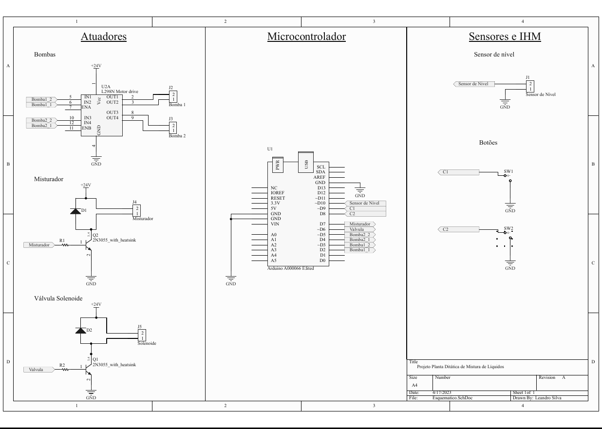
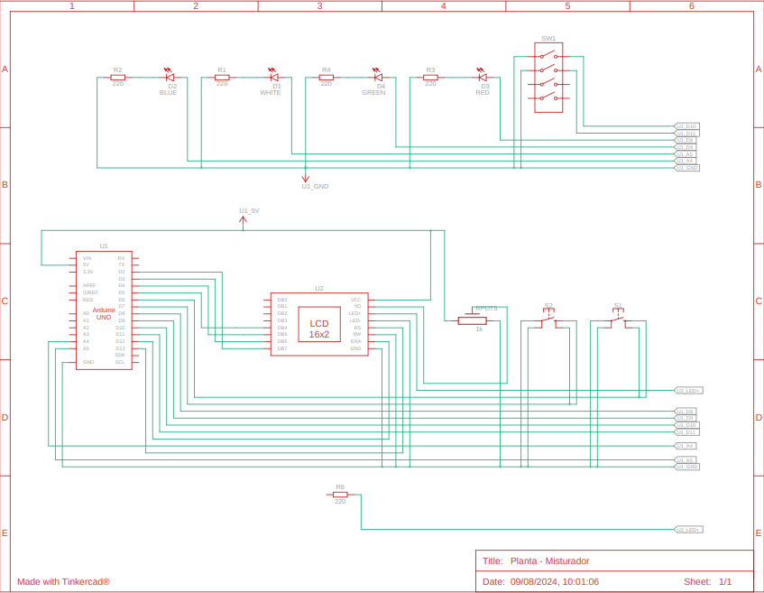

# Projeto: Misturador de Líquidos com Arduino

## Descrição Geral
Este projeto implementa um sistema de mistura de líquidos controlado por um Arduino, utilizando botões, bombas, um misturador, sensores de nível e uma válvula solenoide. O sistema exibe mensagens em um display LCD e permite ao usuário iniciar e controlar o ciclo de mistura.

## Operação do Sistema

### 1. Iniciar Ciclo
- **Passo 1:** Ao pressionar o botão `C1`, será exibida a seguinte mensagem no display LCD: **"Iniciar ciclo? Pressione C1 para confirmar."**
- **Passo 2:** Se o botão `C1` for pressionado novamente dentro de 10 segundos, o sistema iniciará um ciclo de mistura. Se um botão diferente de `C1` for pressionado ou se o botão `C1` não for pressionado novamente dentro do intervalo de 10 segundos, a operação será cancelada, e o sistema retornará à condição inicial.

### 2. Ciclo de Mistura
Um ciclo de mistura consiste nas seguintes etapas:

1. **Acionar a Bomba `B1` por 5 segundos.**
2. **Acionar a Bomba `B2` até que o sensor de nível CHEIO seja ativado.**
3. **Ligar o misturador por 5 segundos.**
4. **Acionar a válvula solenoide até esvaziar o recipiente (sensor de nível VAZIO ativado).**

Durante a execução do ciclo, o estado atual do ciclo será exibido no display LCD.

### 3. Interrupção e Esvaziamento
- **Interrupção do Ciclo:** Ao pressionar o botão `C2` durante a execução de um ciclo, este será interrompido imediatamente. Essa ocorrência será informada no display LCD.
- **Esvaziamento do Recipiente:** Se o botão `C2` for pressionado quando nenhum ciclo estiver sendo executado, o sistema realizará o esvaziamento do recipiente. Essa operação também será informada no display LCD.

## Especificações das Entradas e Saídas Digitais
O equema elétrico da planta didática será montado conforme a figura 1.

Figura 1: Esquema elétrico da planta didática.

  

Fonte: Material da atividade.

### Botões
- **C1 e C2:** São normalmente abertos. A entrada digital estará em nível lógico alto quando o botão não estiver pressionado e em nível lógico baixo quando o botão estiver pressionado.

### Sensores de Nível
- **Sensor de Nível VAZIO:** Opera em nível lógico alto quando acionado (recipiente cheio) e em nível lógico baixo quando o recipiente estiver vazio.
- **Sensor de Nível CHEIO:** Opera em nível lógico baixo quando acionado (recipiente cheio) e em nível lógico alto quando o recipiente não estiver completamente cheio.

### Ativação de Componentes
- **Motor Misturador e Válvula Solenoide:** Ativados em nível lógico alto e desativados em nível lógico baixo.
- **Bombas `B1` e `B2`:** Ativação controlada por um par de pinos. Para acionar, um pino deve estar em nível lógico alto e o outro em nível lógico baixo. Ambos os pinos devem estar em nível lógico baixo para desligar.

## Especificação dos Pinos de I/O

| Componente              | Pino(s) de I/O |
|-------------------------|----------------|
| **Bomba 1**             | A5             |
| **Bomba 2**             | A4             |
| **Botão C1**            | 6              |
| **Botão C2**            | 7              |
| **Misturador**          | 8              |
| **Válvula Solenoide**   | 9              |
| **Sensor de Nível VAZIO** | 10           |
| **Sensor de Nível CHEIO** | 11           |
| **Display LCD**           | rs = 13, en = 12, d4 = 5, d5 = 4, d6 = 3 e d7 = 2|

## Implementação

### 1. Tabela de Máquina de Estados

| Estado Atual              | Entrada                              | Próximo Estado          | Ação                                                        |
|---------------------------|--------------------------------------|-------------------------|-------------------------------------------------------------|
| **IDLE**                  | Botão `C1` pressionado               | WAITING_CONFIRMATION    | Exibir mensagem "Iniciar ciclo? Pressione C1", aguardar confirmação |
| **IDLE**                  | Botão `C2` pressionado               | Esvaziando Recipiente   | Acionar válvula, Exibir "Esvaziando recipiente..."           |
| **IDLE**                  | -                                    | IDLE                    | -                                                           |
| **WAITING_CONFIRMATION**  | Botão `C1` pressionado dentro do tempo limite | MIXING                 | Iniciar ciclo de mistura, Exibir "Iniciando ciclo..."        |
| **WAITING_CONFIRMATION**  | Tempo esgotado sem ação ou `C2` pressionado | IDLE                 | Cancelar operação, Exibir "Operação cancelada"               |
| **MIXING**                | Botão `C2` pressionado               | INTERRUPTED             | Parar todas as operações, Exibir "Ciclo interrompido"        |
| **MIXING**                | Ciclo de mistura concluído           | IDLE                    | Exibir "Ciclo concluído", retornar ao estado inicial         |
| **INTERRUPTED**           | -                                    | IDLE                    | Retornar ao estado inicial                                  |
| **Esvaziando Recipiente** | Sensor de Nível VAZIO desativado     | IDLE                    | Parar válvula, Exibir "Recipiente vazio"                     |

### 2.   Simulação e montagem
Esta implementação foi simulada utilizando o tinkercad, e é possível vizualizar a simulação neste [link](https://www.tinkercad.com/things/4JymtpPK1Lq-funky-borwo/editel?sharecode=jeU74Dh1QXhBi1deMIZKjoglHc_senMifO3WkR5VeX0), e o esquemático do circuito simulado no tinkercad se encontra na figura 2.

Figura 2: Esquemático do arduíno no tinkercad.

  

Fonte: Autoria própria.

O cógigo do sistema utilizando platformIO pode ser visualizado [aqui](/Mixer/src/main.cpp).
O vídeo da montagem feita em sala está disponível [aqui](https://youtube.com/shorts/JOFedwKAGOI?feature=share).

#### Autores

@Felliph-Silva

@MiguelAngelo88
